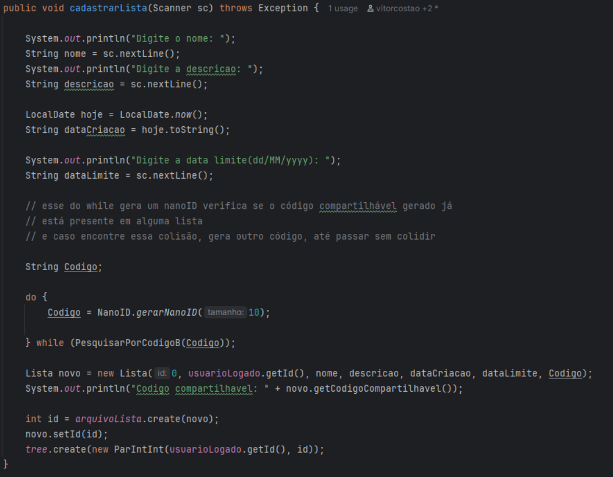
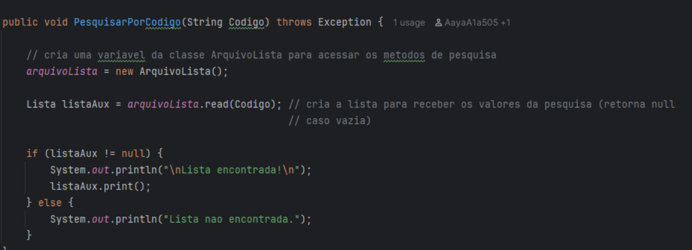

# Relatório TP2 - AEDS III

**Participantes:**  
- Felipe Gabriel de Carvalho  
- Gustavo Henrique dos Santos Dias  
- Raphael Oliveira de Araujo  
- Vitor Costa Oliveira Rolla  

---

## Perguntas e Respostas II

**Há um CRUD de produtos (que estende a classe ArquivoIndexado, acrescentando Tabelas Hash Extensíveis e Árvores B+ como índices diretos e indiretos conforme necessidade) que funciona corretamente?**  
Resposta: Sim, o mesmo pode ser acessado no caminho "> Início > Produtos" onde as opções de listar produtos, buscar por GTIN, e cadastrar produtos se encontram, para desativar o produto é necessario listar (ou buscar por GTIN e ai sim será possivel editar os valores do produto e/ou o desativar.

---

**Há um CRUD da entidade de associação ListaProduto (que estende a classe ArquivoIndexado, acrescentando Tabelas Hash Extensíveis e Árvores B+ como índices diretos e indiretos conforme necessidade) que funciona corretamente?**  
Resposta: Sim, tal CRUD é acessado ao manipular os produtos em uma lista, onde voce pode adicionar remover e alterar a quantidade de produtos e a observação presente no mesmo. 

---

**A visão de produtos está corretamente implementada e permite consultas as listas em que o produto aparece (apenas quantidade no caso de lista de outras pessoas)?**  
Resposta: sim, tal tela é acessada percorrendo o caminho "> Início > Produtos > Listagem" e selecionando um produto.

---

**A visão de listas funciona corretamente e permite a gestão dos produtos na lista?**  
Resposta: Sim, conseguimos testar todas as funções relacionadas a gestão de produtos da lista com sucesso em suas execuções. 

---

**A integridade do relacionamento entre listas e produtos está mantida em todas as operações?**  
Resposta: Sim, existem verificações nas funções para garantir que apenas operações validas sejam executadas. 

---

**O trabalho compila corretamente?**  
Resposta: Sim, basta clonar o repositório e rodar na IDE.  

---

**O trabalho está completo e funcionando sem erros de execução?**  
Resposta: Sim, dado nossos testes nosso programa não apresenta erros de execução, ao menos não conseguimos reproduzir nenhum.

---

**O trabalho é original e não a cópia de um trabalho de outro grupo?**  
Resposta: O trabalho é original, foi utilizado como fonte apenas as classes passadas para CRUD e árvore as quais o professor disponibilizou.  

# Relatório TP1 - AEDS III

**Participantes:**  
- Felipe Gabriel de Carvalho  
- Gustavo Henrique dos Santos Dias  
- Raphael Oliveira de Araujo  
- Vitor Costa Oliveira Rolla  

---

Video demonstrativo no youtube: https://youtu.be/kpWDiY79LIk

---

## Usuários

Nosso sistema, **“Presente Fácil 2.0”**, inicia com a implementação de um CRUD de usuários, estruturado segundo o padrão MVC.  
Para isso, utilizamos o model `Usuário.java`, a classe `ArquivoUsuario.java` — que estende uma classe genérica `Arquivo` — e a classe `ControleUsuario.java`, responsável por todas as operações de CRUD relacionadas ao usuário logado (criação, leitura, atualização e exclusão).

Diferentemente do CRUD geral de usuários, o **ControleUsuario** gerencia as operações específicas do usuário autenticado.  
Na classe `ArquivoUsuario.java`, implementamos um índice indireto chamado **IndiceIndiretoEmail**, que utiliza um par chave-valor `ParIdEmail` com uma **Hash Extensível**.  
Esse índice facilita a lógica de login e a leitura dos dados do usuário.  

O arquivo do índice está armazenado no diretório:
.\dados\usuarios\indiceEmail.d.db

---

### CRUD Usuários

  

Após o login, o usuário pode visualizar seus dados (**READ**), atualizar suas informações (**UPDATE**) ou excluir sua conta (**DELETE**), além de ter acesso ao CRUD de Listas.

---

## Listas

Após a criação do usuário e seu login no sistema, é oferecida a opção de criar uma nova lista ou buscar uma lista existente utilizando o **NanoID**.  
A estrutura do CRUD para listas segue o mesmo padrão do CRUD de usuários, sendo instanciada a partir do model `Lista.java`.  
As operações de CRUD são realizadas pela classe `ArquivoLista.java`, que estende a classe genérica `Arquivo`.

No model `Lista`, o **ID do usuário** que a criou é utilizado como chave estrangeira, garantindo a associação entre listas e seus respectivos criadores.

---

### CRUD Lista

  

---

## Árvore B+

Para otimizar a leitura das listas associadas a cada usuário, implementamos uma estrutura de dados em **Árvore B+** instanciada com o objeto `ParIntInt`.  
Cada par é formado pelo **ID do usuário logado** e pelo **ID da lista criada**, garantindo a associação entre ambos.

Durante as operações, a árvore armazena esses pares e permite a verificação dos elementos de forma eficiente.  
Assim, ao identificar correspondência entre o ID do usuário autenticado e os registros presentes na árvore, o sistema localiza a lista correspondente no arquivo físico e a exibe ao usuário.

---

## Views

Foi criada uma classe para tratar toda a visualização do sistema (`Painel.java`).  
Dentro dessa classe há chamadas para **ControleLista** e **ControleUsuario**, que por sua vez interagem diretamente com os arquivos.  

A estrutura de View consiste em um `while` na camada mais externa da aplicação, que fica rodando enquanto a variável `executando` for `true`.  
Em cada função há chamadas para outras funções (telas), através de uma seleção por `switch case`.

### Métodos e Responsabilidades

tela() → Inicia e mantém a execução do sistema  
exibirMenuInicial() → Menu com opções de login, cadastro e sair  
painelLogin() → Lida com o login do usuário  
painelCadastro() → Lida com o cadastro do usuário  
painelInicio() → Menu principal após o login  
painelMeusDados() → Exibe e permite alterações nos dados do usuário  
alterarMeusDados() → Altera os dados do usuário logado  
excluirUsuario() → Exclui a conta do usuário  
painelMinhasListas() → Exibe as listas do usuário  
painelCadastroListas() → Cria uma nova lista  
painelDetalhesLista() → Mostra detalhes de uma lista  
alterarDadosLista() → Altera nome ou descrição de uma lista  
excluirLista() → Exclui uma lista  
limparTelaWindows() → Limpa a tela do console  
pausar() → Aguarda o usuário pressionar ENTER  

---

## NanoID

Essa é a função responsavel por gerar o **NanoID**, ela define uma string com todos os caracteres validos para a construção do código, e seleciona aleatoriamente posições da string para inserir no código compartilhável, retornando o mesmo.

 

Ele é utilizado na nossa função de cadastro de listas, onde é gerado inicialmente dentro de um laço do while, pois é necessário verificar possíveis colisões, e caso encontre, um novo código é gerado.

 

 a função que verifica as colisões através da função booleana “PesquisarPorCodigoB(String Código)” que le o arquivo contendo o par de codigo compartilhável e ID, caso não encontre retorna false, e o código é utilizado para gerar a nova lista, caso contrário, o loop continua devido ao retorno true da função.

  
 
A existência de um “PesquisarPorCodigoB” implica que o mesmo é apenas um derivado de outra função, que seria a “PesquisarPorCodigo”, que não apenas verifica se o código é válido, mas exibe a lista encontrada através da função da classe lista de exibir os dados, sendo a função utilizada quando o usuário realiza a pesquisa.

 

--------------------------------------------------------------------------------

## Perguntas e Respostas

**Há um CRUD de usuários (que estende a classe ArquivoIndexado, acrescentando Tabelas Hash Extensíveis e Árvores B+ como índices diretos e indiretos conforme necessidade) que funciona corretamente?**  
Resposta: Sim, conforme página 1, utilizamos a classe `ArquivoUsuario` e utilizamos conforme necessário uma Hash Extensível como índice indireto para operações com o email do usuário.  

---

**Há um CRUD de listas (que estende a classe ArquivoLista, acrescentando Tabelas Hash Extensíveis e Árvores B+ como índices diretos e indiretos conforme necessidade) que funciona corretamente?**  
Resposta: Sim, conforme página 2, utilizamos a classe `ArquivoLista` e utilizamos conforme necessário uma Hash Extensível como índice indireto para operações com o usuário e a lista.  

---

**As listas de presentes estão vinculadas aos usuários usando o idUsuario como chave estrangeira?**  
Resposta: Sim, pois as classes de controle garantem o relacionamento entre as listas e o usuário.  

---

**Há uma árvore B+ que registre o relacionamento 1:N entre usuários e listas?**  
Resposta: Sim, a árvore b+ utiliza os pares correspondentes aos IDs dos usuários e aos IDs das listas, ou seja, ela associa as listas ao seu respectivo usuário.  
Isso ocorre durante a criação da lista, já que a árvore irá armazenar o id do usuário logado com o id da lista que foi criada.  

---

**Há uma visualização das listas de outras pessoas por meio de um código NanoID?**  
Resposta: Sim, existe a funcionalidade de pesquisar a lista de outra pessoa utilizando o código NanoID que foi gerado.  

---

**O trabalho compila corretamente?**  
Resposta: Sim, basta clonar o repositório e rodar na IDE.  

---

**O trabalho está completo e funcionando sem erros de execução?**  
Resposta: Aparentemente, não há erros de execução. Houve teste em que a execução obteve sucesso em todas funcionalidades.  

---

**O trabalho é original e não a cópia de um trabalho de outro grupo?**  
Resposta: O trabalho é original, foi utilizado como fonte apenas as classes passadas para CRUD e árvore as quais o professor disponibilizou.  

